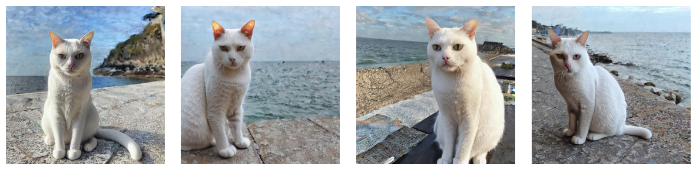
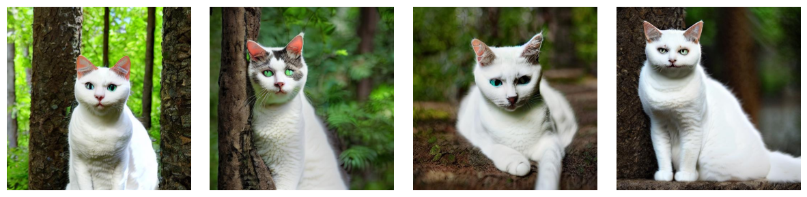

UC Boulder MSDS course work  
DTSA 5511 Deep Learning  

## Project   DreamBooth_Subject_Driven_Generation

This [repo](https://github.com/elfchildRichter/DreamBooth_Subject_Driven_Generation/tree/main) employs DreamBooth to fine-tune the Stable Diffusion model, enabling the generation of images with a specific target subject in diverse scenes. 

**DreamBooth** achieves this by learning from a few instance images to capture and replicate the unique traits of a subject. It determines a specific direction within the generator's latent space, allowing the model to integrate a unique identifier associated with the subject, while preserving the rest of the textual elements.

Here the instance images used are photos of a particular white cat, and the class images were produced using Stable Diffusion before the tuning process.

|Label | Train Images |
| --- | ---|
| instance images   unique_id = 'miru' | |
| class images   class_label = 'cat' | |

 

### **1a - Tune Diffusion Model**

Four models were tuned with combinations of learning_rate and max_train_steps. Each model generated images with three different settings of num_steps and unconditional_guidance_scale.

 

| Attribute          | Model 1 | Model 2 | Model 3 | Model 4 |
|--------------------|---------|---------|---------|---------|
| Learning Rate      | 1e-6    | 1e-6    | 3e-6    | 3e-6    |
| Max Train Steps    | 600     | 900     | 600     | 900     |
| steps = 30   ugs = 6    | | |  |  |
| steps = 30   ugs = 12   |  |  |  |  |
| steps = 50   ugs = 12   |  |   |  |  |

prompt = 'a photo of miru cat by the sea'

 

For this task, a learning rate of 3e-6 is deemed relatively more appropriate, observing that the loss decreases as the number of training epochs increases. Additionally, when steps are set to 900, the model  attains the lowest observed loss value of 0.0894. The Model 4 is the most effective among the four tuned models.

After experimenting with different combinations of steps and ugs, setting them to 50 and 12, respectively, can generate images that are not overfitted and achieve a suitable balance between instance image fidelity and image quality.

 

| Prompt | Model 4: lr_rate=3e-6, max_train_steps=900, steps=50, ugs=12 |
|--- |--- |
| 'a photo of miru cat by the sea' |  |
| 'a  photo of miru cat in the forest' | |
| 'a photo of miru cat in Jiufen' | |
| 'a photo of miru cat on a gondola in venice' | |

Images generated by model 4 with different prompts.

 

Subsequently, further adjustments can be attempted on additional parameters and fine-tuning of the text encoder to make the model more suitable for this task.

 

### Reference

- [Fine Tuning Text-to-Image Diffusion Models for Subject-Driven Generation](https://arxiv.org/abs/2208.12242)
- [Training Stable Diffusion with Dreambooth using Diffusers](https://huggingface.co/blog/dreambooth)
- [Hugging Face DreamBooth](https://huggingface.co/docs/diffusers/training/dreambooth)
- [Keras | Code examples | DreamBooth](https://keras.io/examples/generative/dreambooth/)
- [Sayakpaul Dreambooth-Keras](https://github.com/sayakpaul/dreambooth-keras)
- [DreamBooth training example](https://github.com/huggingface/diffusers/tree/main/examples/dreambooth)
- [Fine-tuning Stable Diffusion](https://keras.io/examples/generative/finetune_stable_diffusion/)

  

### **1b - Tune Diffusion Model**

learning_rate=3e-6   
max_train_steps=1200  
beta_schedule='linear'  
steps=55, ups=13 

| Attribute  | | |
| --- | --- | --- |
| variance_type| 'fixed_small' | 'fixed_small_log' |
|without negative_prompt |  | |
| variance_type | 'learned' | 'learned_range' |
|without negative_prompt |  |  |
| variance_type | 'learned' | 'learned_range' |
|with negative_prompt |  |  |

The model with variance_type set to 'fixed_small_log' or 'learned' performs slightly better than the other two options. 

Setting a negative_prompt can restrict unwanted elements, but it may degrade image quality and instance fidelity. Increasing the complexity of the prompt scene also has this effect. More images: [notebook](https://github.com/elfchildRichter/DreamBooth_Subject_Driven_Generation/blob/main/generated_images.ipynb).

 

### **2 - Tune Diffusion Model + Text Encoder**

learning_rate = 2e-6  
max_train_steps = 400  
beta_schedule='linear' 
variance_type='learned' 
steps=50, ups=12  

| Attribute  | normal images | undesired images |
| --- | --- | --- |
| **By the sea**   without neg_prompt|  |  |
| **By the sea**   with neg_prompt|  |  |
| **In the forest**   without neg_prompt|  |  |
| **In the forest**   with neg_prompt|  |  |
| **In Jiufen**   without neg_prompt|  |  |
| **In Jiufen**   with neg_prompt|  |  |
| **On gondola in Venice**   without neg_prompt|  |  |
| **On gondola in Venice**   with neg_prompt|  |  |

After tuning the model along with the text encoder, the quality and diversity of the images have noticeably increased. Previously, using the prompt 'a photo of miru cat by the sea' would simply produce an image of a cat by the sea. However, now the same prompt might generate more varied scenes; the images generated could be as simple as before, or they could be **a real photo of** a cat by the sea, or a painting.

Before using negative_prompt, issues such as multiple tails, legs, or incorrectly positioned tails occurred just as before; using negative_prompt improved these situations. As the complexity of the scene increased, sometimes the target becomes less prominent, which is similar to previous models.

The proportion of white cats has increased, improving color fidelity compared to previous models. However, the fidelity of the physical appearance seems to have decreased; the appearances of the cats are not always very similar to the target cat, showing greater variation, but they are all short-haired white cats.

